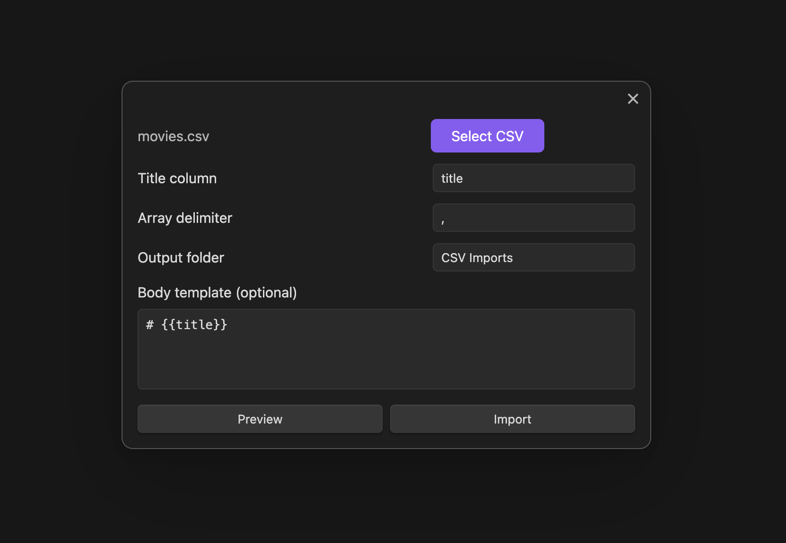
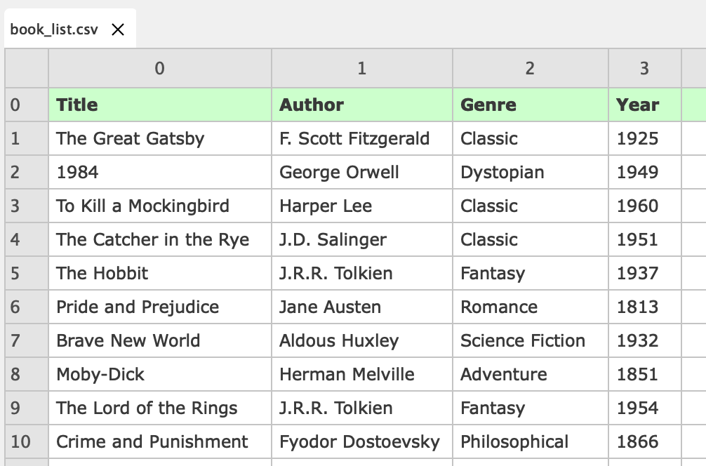
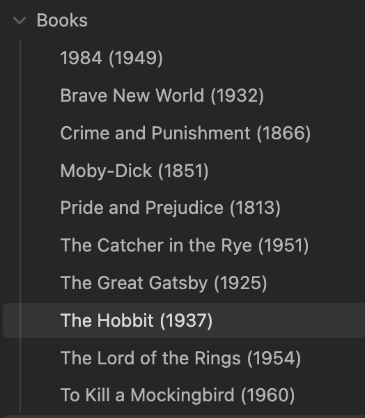

# CSV Importer

Import a CSV file to create Obsidian notes. Each CSV column becomes a YAML property on the created note. This makes the notes immediately usable with **Obsidian Bases**—so you can filter, sort, and query on any column from your CSV.



## Quick Start

1. Run command: **"CSV Importer: Import CSV to notes"**
2. Select your CSV file
3. Specify the title column (e.g., `title`, `name`)
4. Click **Import**

## Usage

- **Automatic YAML**: All CSV columns → YAML properties
- **Wikilinks**: Turn fields into `[[links]]` for graph visualization
- **Arrays**: Split multi-value fields (e.g., `fiction; classic` → list)
- **Templates**: Customize note body with Handlebars
- **Preview**: See first note before importing

## How It Works

Transform your CSV into connected notes:

**From CSV**



**To Markdown Notes**



### Templates

**Wikilink helpers**:

- `{{wikilink field}}` — single value → `[[value]]`
- `{{wikilinks field}}` — multi-value → `[[item1]], [[item2]]`

**Field normalization**:

- Spaces become underscores: `Runtime (mins)` → `{{runtime_mins}}`
- Special chars removed: `Author-Name` → `{{AuthorName}}`

```markdown
# {{title}}

Director: {{wikilink director}}
Genres: {{wikilinks genre}}
```

## Use Cases

- Film/TV collections
- Book libraries
- Contact databases
- Product catalogs
- Travel itineraries
- Board game collections
